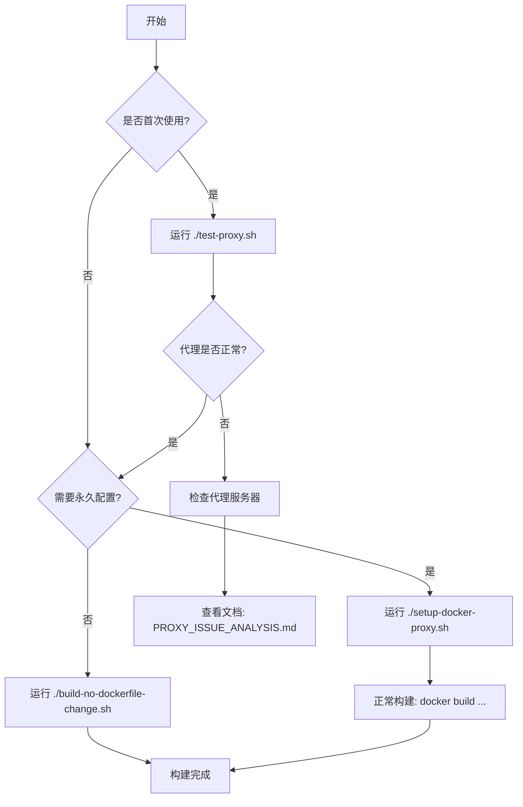

# 🎯 从这里开始 / START HERE

## ⚡ 三步解决你的问题（不修改 Dockerfile）

### 第一步：理解问题

你的 Docker 构建失败，因为：
- ❌ 容器内的 `apt` 使用了错误的代理：`172.16.21.69:7897`（返回 502 错误）
- ✅ 你配置的正确代理是：`172.16.21.5:7890`

**为什么会这样？**
因为 Docker 守护进程的代理配置不会自动传递给构建过程中的容器。

---

### 第二步：选择解决方案

<table>
<tr>
<th>方案</th>
<th>适合场景</th>
<th>操作</th>
</tr>

<tr>
<td>🚀 <b>快速构建</b><br/>（临时方案）</td>
<td>
• 只构建一次<br/>
• 测试用<br/>
• 不想改配置
</td>
<td>

```bash
./build-no-dockerfile-change.sh \
  Dockerfile.1.91-cross-aarch64-linux-gnu \
  rust-cross:1.91
```

</td>
</tr>

<tr>
<td>⚙️ <b>永久配置</b><br/>（推荐）</td>
<td>
• 经常构建<br/>
• 长期使用<br/>
• 一劳永逸
</td>
<td>

```bash
# 配置一次
./setup-docker-proxy.sh

# 之后正常构建
docker build \
  -f Dockerfile.1.91-cross-aarch64-linux-gnu \
  -t rust-cross:1.91 .
```

</td>
</tr>

<tr>
<td>🔍 <b>诊断问题</b></td>
<td>
• 不确定问题<br/>
• 需要排查<br/>
• 首次使用
</td>
<td>

```bash
./test-proxy.sh
```

</td>
</tr>
</table>

---

### 第三步：执行命令

#### 方式 A：最快速（推荐先试这个）

```bash
# 给脚本执行权限
chmod +x build-no-dockerfile-change.sh

# 直接构建
./build-no-dockerfile-change.sh Dockerfile.1.91-cross-aarch64-linux-gnu rust-cross:1.91
```

#### 方式 B：手动输入（如果脚本不可用）

```bash
docker build \
  --build-arg HTTP_PROXY=http://172.16.21.5:7890 \
  --build-arg HTTPS_PROXY=http://172.16.21.5:7890 \
  --build-arg http_proxy=http://172.16.21.5:7890 \
  --build-arg https_proxy=http://172.16.21.5:7890 \
  --no-cache \
  -f Dockerfile.1.91-cross-aarch64-linux-gnu \
  -t rust-cross:1.91 \
  .
```

---

## 📚 想了解更多？

| 需求 | 查看文档 |
|------|---------|
| 📖 完整使用指南（中文） | **使用指南.md** ⭐⭐⭐⭐⭐ |
| ❓ 为什么失败？为什么出现21.69？ | **QUICK_ANSWER.md** |
| 🛠️ 所有不修改Dockerfile的方案 | **README_NO_DOCKERFILE_CHANGE.md** |
| 📋 文件和脚本索引 | **FILES_INDEX.md** |
| 🔬 技术深度分析（英文） | **PROXY_ISSUE_ANALYSIS.md** |

---

## 🛠️ 三个核心工具

```bash
# 1. 诊断工具 - 检查所有配置
./test-proxy.sh

# 2. 构建工具 - 带代理参数构建（不修改Dockerfile）
./build-no-dockerfile-change.sh [Dockerfile路径] [镜像名]

# 3. 配置工具 - 永久配置代理
./setup-docker-proxy.sh
```

---

## 💡 最佳实践流程



**简化版：**

1. 首次使用 → 运行 `./test-proxy.sh`
2. 长期使用 → 运行 `./setup-docker-proxy.sh`（一次性）
3. 临时构建 → 运行 `./build-no-dockerfile-change.sh`

---

## ⚠️ 常见问题

<details>
<summary><b>Q1: 运行脚本提示权限不足？</b></summary>

```bash
chmod +x *.sh
```

</details>

<details>
<summary><b>Q2: 还是报 502 Bad Gateway？</b></summary>

清除构建缓存：
```bash
docker builder prune -af
./build-no-dockerfile-change.sh Dockerfile.1.91-cross-aarch64-linux-gnu rust-cross:1.91
```

</details>

<details>
<summary><b>Q3: 代理连接超时？</b></summary>

测试代理：
```bash
curl -x http://172.16.21.5:7890 http://archive.ubuntu.com
```

如果失败，检查代理服务器是否运行。

</details>

<details>
<summary><b>Q4: 需要修改代理地址？</b></summary>

编辑脚本文件顶部的变量：
```bash
# 在 build-no-dockerfile-change.sh 或 setup-docker-proxy.sh 中
PROXY_HTTP="http://your-proxy:port"
PROXY_HTTPS="http://your-proxy:port"
```

</details>

---

## 🎯 核心概念

### 为什么 Docker 守护进程的代理配置不起作用？

```
┌─────────────────────────────────────────────┐
│ Docker 守护进程                              │
│ 代理: 172.16.21.5:7890                      │
│ ✓ 用于: docker pull (拉取镜像)             │
│ ✗ 不用于: 构建过程                          │
└─────────────────────────────────────────────┘
                    │
                    ▼
┌─────────────────────────────────────────────┐
│ 构建容器 (FROM ubuntu:20.04)                │
│ ✗ 默认不继承守护进程的代理                  │
│ ✗ 使用了旧的代理: 172.16.21.69:7897       │
│                                              │
│ RUN apt update  ← 502 Bad Gateway!         │
└─────────────────────────────────────────────┘
```

### 解决方案原理

```
方案1: --build-arg
┌─────────────────────────────────────────────┐
│ docker build --build-arg HTTP_PROXY=...     │
│          ↓                                   │
│    ┌──────────────────┐                     │
│    │ 构建容器          │                     │
│    │ ENV HTTP_PROXY=... ✓                   │
│    │ apt update ✓      │                     │
│    └──────────────────┘                     │
└─────────────────────────────────────────────┘

方案2: ~/.docker/config.json
┌─────────────────────────────────────────────┐
│ Docker BuildKit 读取配置                     │
│ ~/.docker/config.json                       │
│          ↓                                   │
│    自动应用到所有构建 ✓                      │
└─────────────────────────────────────────────┘
```

---

## 📌 快速命令参考

```bash
# === 诊断 ===
./test-proxy.sh                              # 完整诊断
curl -x http://172.16.21.5:7890 http://archive.ubuntu.com  # 测试代理

# === 构建 ===
./build-no-dockerfile-change.sh Dockerfile.xxx image:tag   # 带代理构建
docker builder prune -af                     # 清除缓存

# === 配置 ===
./setup-docker-proxy.sh                      # 永久配置
cat ~/.docker/config.json                    # 查看配置
sudo systemctl restart docker                # 重启Docker

# === 检查 ===
docker info | grep -i proxy                  # 检查Docker代理
systemctl show docker | grep -i proxy        # 检查守护进程代理
```

---

## 🎁 总结

✅ **问题**：apt 使用错误的代理 172.16.21.69:7897  
✅ **原因**：Docker 守护进程代理不传递给构建容器  
✅ **解决**：通过 --build-arg 或 ~/.docker/config.json 注入正确的代理  
✅ **要求**：不需要修改 Dockerfile  

**立即开始：**
```bash
./build-no-dockerfile-change.sh Dockerfile.1.91-cross-aarch64-linux-gnu rust-cross:1.91
```

---

**需要帮助？** 查看 **使用指南.md** 或 **FILES_INDEX.md**
